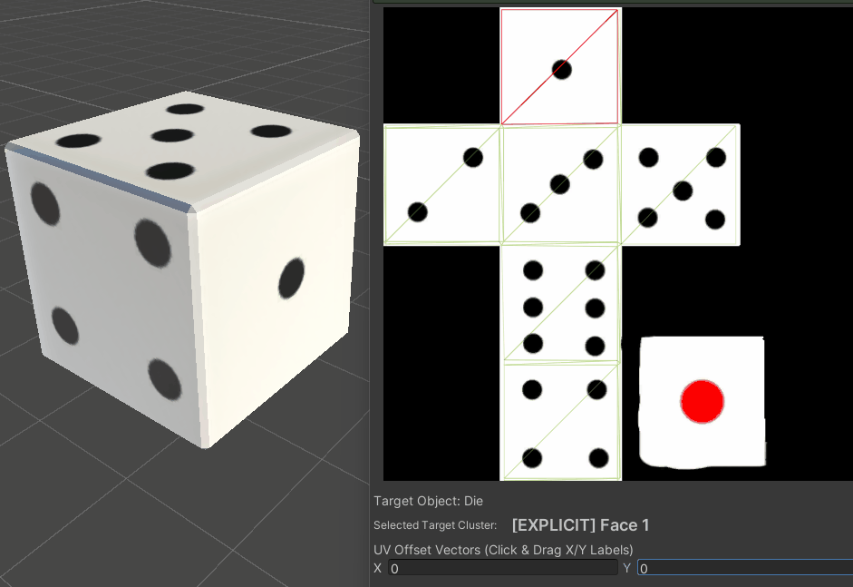

# Unity Trim Sheet Editor

A Unity utility that allows altering UV islands on a mesh without returning to external 3D modeling programs.

---

## What This Tool Is For

A common operation in game development is reskinning a mesh by altering the UV islands. This operation requires someone to go into an external tool like Blender, Maya, Substance Painter/Designer to alter the UV islands and re-import them into Unity.

This tool speeds up that workflow by allowing you to perform this operation within the Unity editor. You can define individual UV islands directly in the Unity Editor and dynamically move, rotate or scale them.

### Core Features
* **Designate New UV Islands:** Group UV faces together to define explicit UV islands to prevent texture stretching or skewing.
* **Translate, Rotate, Scale:** Move, rotate, and scale UV islands to add customize texturing.
* **Hard-Baking:** Exports the mesh as a new asset with the updated UVs baked in. Either bake the mesh only or create a prefab with the mesh and original material already linked.

---

## How to Install and Use

### 1. Project Setup
#### Package Manager (recomended)
1. Navigate to `Window` **>** `Package Manager`.
2. Click the `+` button and select `Add package from git URL`.
3. Enter the URL: [https://github.com/wileydev/TrimSheetUtility](https://github.com/wileydev/TrimSheetUtility)
4. Click `Add`.

#### Git Repository
1. Clone this repository and save the scripts inside your project directory.
2. **Important:** Ensure that the contents of the Editor folder remain in a folder called Editor.

### 2. Step-by-Step Workflow Pipeline

#### Step A: Initialize the Workbench Window
* In the Unity Editor top menu, go to `Window` **>** `Trim Sheet Editor`.
* The Utility can only work with GameObjects that have a Mesh Collider.  

#### Step B: Define Island Groups (Tab 1)
* Select `Tab 1: Group Islands` in the tool window.
* In the Scene view, hold `Shift` and click individual mesh faces to add or remove them from your selection. 
* Enter a title for your custom island partition and click `"Extract Faces & Split to New Island"`. This physically duplicates the shared boundary vertex points to prevent seam tearing.

#### Step C: Adjust Texture Placements (Tab 2)
* Switch to `Tab 2: Transform Islands`.
* Hold `Ctrl` and left-click any island in the 3D viewport. The 2D preview frame highlights its exact boundary limits.
* Adjust the `UV Offset Vector` (click-and-drag on the X and Y labels) or the `UV Rotation Angle` slider or the `UV Scale Factor Slider`. 

#### Step D: Hard-Bake
When your asset variation setup is complete, you have 3 options:
* **Option A: Leave As-Is** Leave the mesh as is, the Game Object will have a TrimIslandModifier component on it and no new asset files need to be created.
* **Option A: Bake Mesh Only** – Creates and saves a permanent `.asset` mesh file on disk. This will be just a mesh and a material will need to linked to the Mesh Renderer to see the baked UVs
* **Option B: Bake Full Prefab** – Creates a `.asset` mesh file and a new copy of the `.mat` file, along with a `.prefab` file that can just be dropped into the scene. 

---

## License
This package is distributed under the MIT License. See the accompanying `LICENSE` file for details.
